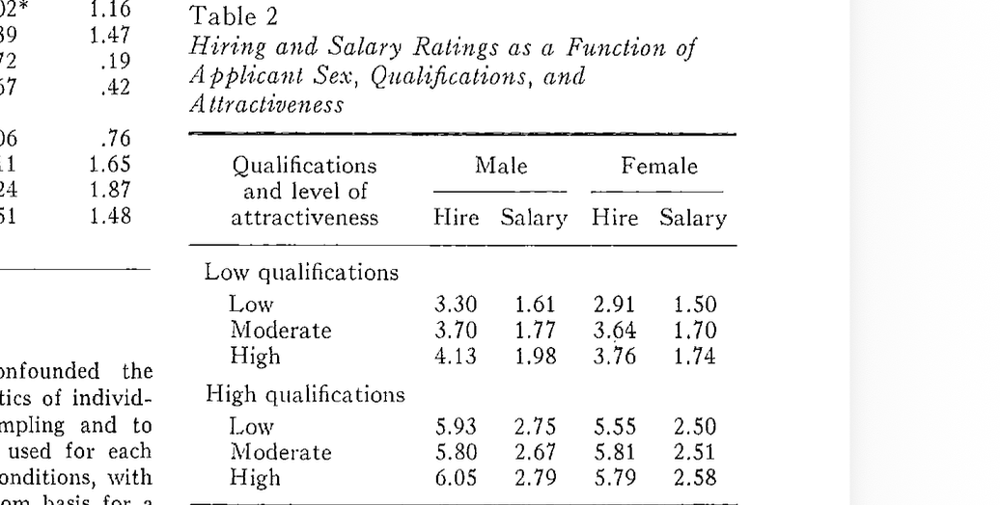

<!-- _class: lead -->
# Does a Photo Help Your Job Application?

## Šimon Brávek
---

# 1. Research question

If its socially acceptable to include *or* not include a photo in your cv application, how does the choice of photo affect you chances of being asked for an interview?

Quick poll:
- Would you include a photo on your CV if it was optional?
- What would your reason be?

---

# 2. Background

- In some countries, CV photos are common/optional; in others they are discouraged.
    - DACH, Japan, China 
    - USA, Canada, Australia
    - Scandinavia, France, Netherlands, Latin America
- A photo can change the *first impression* before skills are considered.
- Researchers call this a *beauty premium* (or a penalty).

---

# 3. Methodology

What I used:
- Materials: peer-reviewed journal articles and working papers.
- 3 correspondence (field) experiments: fake CVs sent to real job ads.
- 1 laboratory experiment: raters scored resumes with photos.

Why this matters:
- Field experiments isolate the effect of the photo because the CVs are otherwise identical.

---

# 4. Findings 1 (Israel)
Field experiment: 5,312 CVs to 2,656 job openings.
Takeaway:
- Attractive men gain a clear advantage; women do best with no photo (Ruffle and Shtudiner 10).

---

# Table 1 
_The Effect of Included Photo on Callback Rate_

| Sex | Photo|  Invited to interview |
| :--- | :--- | ---: |
| Male | Attractive | 19.7% |
| Female | No photo    | 16.6% |
| Male | No photo | 13.7% |
| Female | Plain | 13.6% |
| Female | Attractive | 12.8% |
| Male | Plain | 9.2% | 

(Ruffle and Shtudiner 9).

---

# 4. Findings 2 (Italy)
Field experiment: 11,008 CVs to 1,542 job openings
Studied many effects
Takeaway:
- Beauty helps both genders, but unattractive women are hit hardest (Busetta et al. 6).

---

# Table 2
_Effect of Included Photo on Callback Rate_

| Candidate type | Photo |  Callback rate |
| :--- | :--- | ---: |
| Italian woman | Attractive | 54% |
| Italian man | Attractive | 47% |
| Italian man | No photo | 41% |
| Italian woman | No photo | 37% |
| Italian man | Unattractive | 26% |
| Italian woman | Unattractive | 7% |

(Busetta et al. 7).

---

# 4. Findings 3 (Belgium) 

Belgium field experiment: 1,056 job openings; only Facebook profile picture varied

- Best Facebook picture got 38% more interview invitations than the worst (Baert 11).
- Effect looked stronger for highly educated candidates and when recruiters were women (Baert 9-11).

Audience question:
- If employers might look you up online, is your profile photo part of your "application"?

---

---

# 5. Conclusion

Answer to the research question:
- In countries where photos are optional, a photo can change your chance of a callback, but the direction depends on context and gender.

What this means for job seekers:
- If you attach a photo, you may trigger bias (positive or negative).
- If you do not attach a photo, recruiters may still judge you via social media.

Final audience prompt:
- Should employers be allowed to consider appearance at all in early screening?

---

# 6. Works Cited (MLA)

Baert, Stijn. "Facebook Profile Picture Appearance Affects Recruiters' First Hiring Decisions." *New Media & Society*, 2017, doi:10.1177/1461444816687294.

Busetta, Giovanni et al. "Searching for a Job Is a Beauty Contest." *Munich Personal RePEc Archive* (MPRA Paper No. 49825), 30 Aug. 2013. SSRN, https://ssrn.com/abstract=2331921. Accessed 25 Jan. 2026.

Dipboye, Robert L. et al. "Sex and Physical Attractiveness of Raters and Applicants as Determinants of Resume Evaluations." *Journal of Applied Psychology*, vol. 62, no. 3, 1977, pp. 288-294.

---

Ruffle, Bradley J., and Ze'ev Shtudiner. "Are Good-Looking People More Employable?" *Management Science*, forthcoming. ResearchGate, https://www.researchgate.net/publication/228279644_Are_Good-Looking_People_More_Employable. Accessed 25 Jan. 2026.
